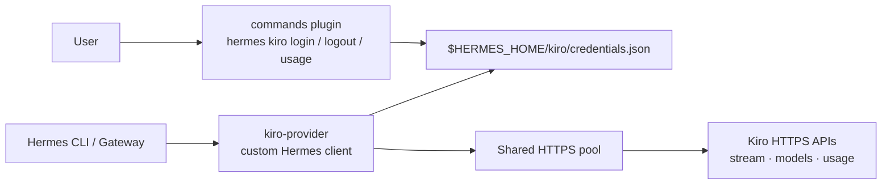

# hermes-plugin-kiro

Native Kiro model-provider plugin for Hermes. It connects Hermes directly to Kiro over HTTPS: no local HTTP listener, proxy, daemon, or `kiro-cli` is required.

## Why native HTTPS

- **Direct transport:** Hermes streams Kiro responses over one shared HTTPS connection pool, including concurrent conversations.
- **No local service:** nothing listens on a loopback port, no helper binary is downloaded, and no daemon has to be supervised.
- **Native Kiro auth:** AWS Builder ID or IAM Identity Center device authorization stores only the Kiro OIDC registration and tokens under `$HERMES_HOME/kiro/credentials.json` (directory `0700`, file `0600`). Tokens refresh automatically.
- **Kiro-aware runtime:** live model catalog, Kiro event-stream framing, tool calls/results, and Kiro usage limits are handled by the provider client.

## Architecture



## Why two plugins

Hermes discovers model providers and command plugins through separate native extension paths:

- **`provider/`** is `kind: model-provider`. It registers Kiro for `/model`, the model picker, CLI, gateway, and auxiliary calls.
- **`commands/`** is `kind: standalone`. It owns the interactive terminal login and the `hermes kiro` / `/kiro` command surfaces.

They share one credential store and one provider; the split exists only because a model-provider plugin is deliberately not loaded by Hermes' command-plugin manager.

### Why login needs its own plugin today

The model-provider package is loaded for provider discovery, but Hermes does not run its command-registration hook and does not expose a plugin authentication callback for device authorization. The standalone package supplies that missing command surface while the provider continues to own the credentials and HTTPS client. [Upstream feature request #111258](https://github.com/NousResearch/hermes-agent/issues/111258) proposes a native provider-auth hook so a future version can remove this companion plugin.

## Install

```bash
curl -fsSL https://raw.githubusercontent.com/anpicasso/hermes-plugin-kiro/main/install.sh | bash
```

The installer installs both plugin directories and enables the command plugin. It **does not restart anything**.

- A new terminal can immediately run `hermes kiro login`.
- Restart an already-running Hermes gateway once so it imports the newly installed provider:

```bash
systemctl --user restart hermes-gateway
```

Then authenticate:

```bash
hermes kiro login
```

Choose AWS Builder ID or corporate IAM Identity Center with the arrow keys. Flags remain available for automation:

```bash
hermes kiro login --start-url 'https://YOUR-START-URL.awsapps.com/start' --region us-east-1
hermes kiro usage
hermes kiro logout
```

## Manual install

```bash
hermes plugins install anpicasso/hermes-plugin-kiro/commands --no-enable
hermes plugins install anpicasso/hermes-plugin-kiro/provider --no-enable
hermes plugins enable kiro
```

`logout` removes only this plugin's local credentials. It does not invent a remote revoke endpoint.

## Development

```bash
PYTHONPATH=provider ~/.hermes/hermes-agent/venv/bin/python -m pytest tests -q
hermes plugins doctor commands --ci
hermes plugins doctor provider --ci
```

Kiro is an undocumented private API. Use your own entitlement; never commit credentials.
