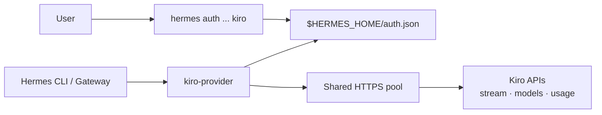

# hermes-kiro-provider

Native Kiro model-provider plugin for Hermes. It connects directly to Kiro over HTTPS—no local proxy, daemon, helper binary, or `kiro-cli`.

## Native Hermes integration

- **Authentication:** `hermes auth add|status|refresh|logout kiro`
- **Credential storage:** OAuth tokens and Kiro metadata live in Hermes' profile-scoped `auth.json` credential pool, including multi-account priority and safe cross-process refresh
- **Usage:** the normal `/usage` command renders Kiro allowances and reset times
- **Models:** live Kiro models appear in main and auxiliary model pickers, with curated offline fallbacks
- **Capabilities:** Hermes knows the bundled fallback models support tools and are text-only
- **Transport:** direct Kiro event streams, tool calls/results, and automatic 401 recovery



Older releases stored credentials in `$HERMES_HOME/kiro/credentials.json` and used a `KIRO_AUTH` sentinel. The first native auth/runtime operation migrates that state into `auth.json` and removes the obsolete files.

## Install

Use Hermes' built-in plugin installer (Hermes Agent 0.21.3 or newer):

```bash
hermes plugins install anpicasso/hermes-kiro-provider/provider
```

Plugins are profile-scoped. Install once per profile that should use Kiro:

```bash
hermes --profile work plugins install anpicasso/hermes-kiro-provider/provider
```

Restart an already-running multiplexed gateway once after installation so it imports the provider:

```bash
hermes gateway restart
```

For a non-multiplexed gateway serving one named profile:

```bash
hermes --profile work gateway restart
```

## Authenticate

```bash
hermes auth add kiro
```

Choose AWS Builder ID or corporate IAM Identity Center interactively. Provider-specific auth values are requested by the plugin because `hermes auth` intentionally does not add plugin-defined flags.

Useful native commands:

```bash
hermes auth status kiro
hermes auth list kiro
hermes auth refresh kiro
hermes auth logout kiro
```

For a named profile, use Hermes' global profile option:

```bash
hermes --profile work auth add kiro
```

Then select Kiro for the main model or any auxiliary task through the normal Hermes model pickers. When Kiro is active, `/usage` uses the provider's native account-usage hook.

## Development

```bash
HERMES_HOME="$(mktemp -d)" \
PYTHONPATH="$HOME/.hermes/hermes-agent:provider" \
  "$HOME/.hermes/hermes-agent/venv/bin/python3" -m pytest tests -q

hermes plugins doctor ./provider --ci
```

Kiro is an undocumented private API. Use your own entitlement; never commit credentials.
