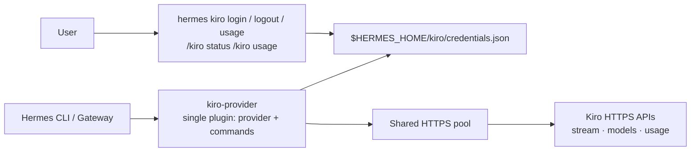

# hermes-kiro-provider

Native Kiro model-provider plugin for Hermes. It connects Hermes directly to Kiro over HTTPS: no local HTTP listener, proxy, daemon, or `kiro-cli` is required.

## Why native HTTPS

- **Direct transport:** Hermes streams Kiro responses over one shared HTTPS connection pool, including concurrent conversations.
- **No local service:** nothing listens on a loopback port, no helper binary is downloaded, and no daemon has to be supervised.
- **Native Kiro auth:** AWS Builder ID or IAM Identity Center device authorization stores only the Kiro OIDC registration and tokens under `$HERMES_HOME/kiro/credentials.json` (directory `0700`, file `0600`). Credentials and refreshes follow the active Hermes profile. Tokens refresh automatically.
- **Kiro-aware runtime:** live model catalog, Kiro event-stream framing, tool calls/results, and Kiro usage limits are handled by the provider client.

## Architecture



## Why the provider registers its own commands

There is one plugin: `provider/`, `kind: model-provider`. It owns the profile, the client, **and** the `hermes kiro` / `/kiro` command surfaces (`provider/commands.py`).

This needs a workaround, and it is worth understanding why. Hermes discovers model providers and command plugins through separate paths, and the command-plugin loader deliberately skips `kind: model-provider` manifests (`hermes_cli/plugins_discovery.py`), so a model-provider's `register(ctx)` never receives a live context — the hook that would normally register `hermes kiro` and `/kiro` simply never fires. There is also no registration hook for the OAuth provider-auth registries, so a plugin cannot supply `oauth_device_code`; [upstream feature request #111258](https://github.com/NousResearch/hermes-agent/issues/111258) proposes the seam, and #113463 asks for the `/usage` hook.

Until one of those lands, the provider closes the gap from inside its own import (`provider/__init__.py`, `_register_commands`): it constructs a `PluginContext`, registers the CLI and slash commands, and — because `hermes_cli/auth.py` builds its provider registry eagerly at import, *before* plugins load — the registration happens when `providers/` discovery imports the plugin, which is early enough for both the CLI and the gateway.

That construction touches internal API (`PluginContext`, `PluginManifest`). If a Hermes refactor breaks it:

- registration failure never takes the provider down — it is wrapped, prints one stderr line, and the provider itself still works;
- everything remains runnable standalone via `python ~/.hermes/plugins/kiro-provider/commands.py {login|status|usage|logout}`, which imports no `hermes_cli` code at all (enforced by a test).

Earlier versions of this project shipped a second `kind: standalone` companion plugin for commands. That is no longer needed.

## Install

```bash
curl -fsSL https://raw.githubusercontent.com/anpicasso/hermes-kiro-provider/main/install.sh | bash
```

The installer installs the plugin **for one Hermes profile**. It uses the active profile (`hermes profile use <name>`); if `HERMES_HOME` is set, that explicit profile home wins. It **does not restart anything**.

### Profiles

Plugins live under each profile's `$HERMES_HOME/plugins`, so install them once in every profile that will use Kiro. Each profile then has its own `$HERMES_HOME/kiro/credentials.json`; logging into one never shares its Kiro account with another.

```bash
# Install and log in for the active profile.
hermes profile use kaito
curl -fsSL https://raw.githubusercontent.com/anpicasso/hermes-kiro-provider/main/install.sh | bash
hermes kiro login

# Or target any profile explicitly without changing the active profile.
curl -fsSL https://raw.githubusercontent.com/anpicasso/hermes-kiro-provider/main/install.sh | HERMES_PROFILE=kaito bash
hermes kiro login --profile kaito

# Target the default profile explicitly, even while another profile is active.
curl -fsSL https://raw.githubusercontent.com/anpicasso/hermes-kiro-provider/main/install.sh | HERMES_PROFILE=default bash
```

- A new terminal can immediately run `hermes kiro login`.
- Restart an already-running Hermes gateway once so it imports the newly installed provider:

```bash
systemctl --user restart hermes-gateway
```

Then authenticate:

```bash
hermes kiro login
```

Choose AWS Builder ID or corporate IAM Identity Center with the arrow keys. Flags remain available for automation:

```bash
hermes kiro login --start-url 'https://YOUR-START-URL.awsapps.com/start' --region us-east-1
hermes kiro usage
hermes kiro logout
```

## Manual install

```bash
hermes plugins install anpicasso/hermes-kiro-provider/provider --ref "$REF"
```

Or plain `hermes plugins install anpicasso/hermes-kiro-provider/provider` and nothing else — one plugin, no enable step needed for a `model-provider`.

If `hermes kiro` will not register (a Hermes refactor changed internal plugin API), run the commands standalone:

```bash
python ~/.hermes/plugins/kiro-provider/commands.py {login|status|usage|logout}
```

`logout` removes only this plugin's local credentials. It does not invent a remote revoke endpoint.

## Development

```bash
PYTHONPATH=provider ~/.hermes/hermes-agent/venv/bin/python -m pytest tests -q
hermes plugins doctor commands --ci
hermes plugins doctor provider --ci
```

Kiro is an undocumented private API. Use your own entitlement; never commit credentials.
